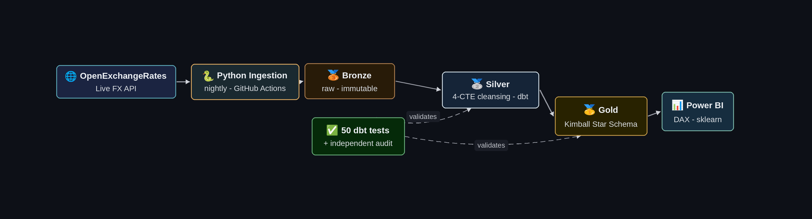
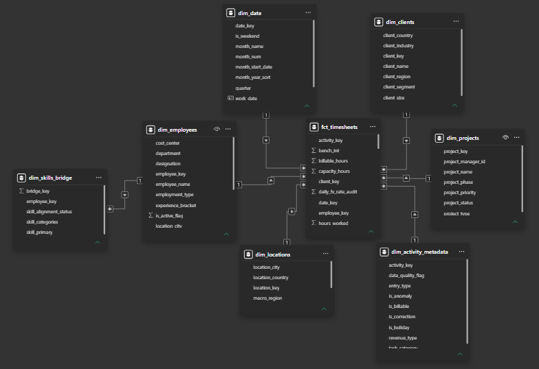
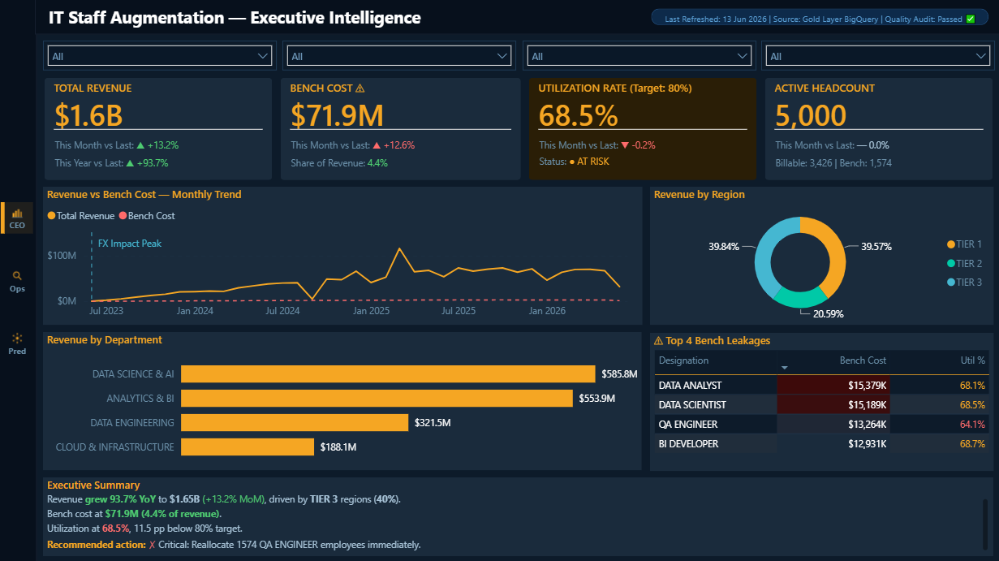
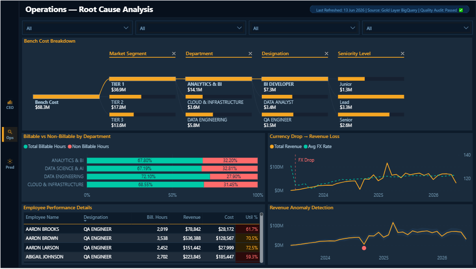
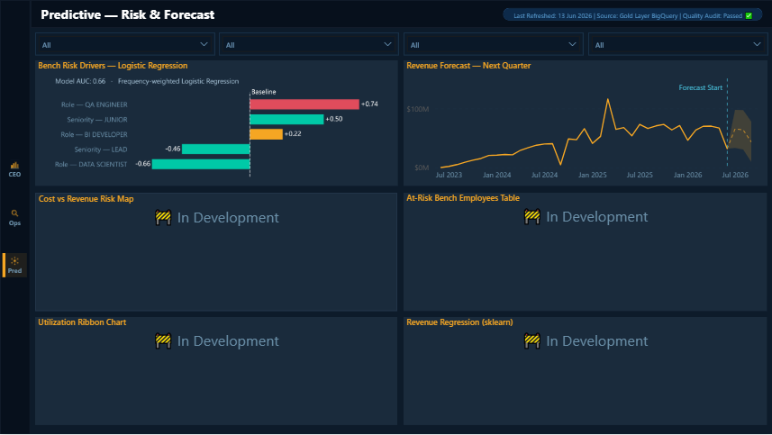

<div align="center">

# Enterprise Workforce Analytics
### Production-Grade Data Pipeline for IT Staff Augmentation Margin Intelligence

A **Software Engineering** approach to analytics — strict version control, immutable raw data, tested transformations, and CI/CD — applied to a real business problem.

[](#architecture)
[](#architecture)
[](#data-quality)
<br>
[](#data-model)
[](#the-dashboard)

</div>

---

## At a Glance

| Feature | Details |
|---|---|
| **What** | End-to-end analytics platform that predicts bench-cost risk & revenue for a staff-augmentation firm |
| **Scale** | 3,750,002 rows · 5,000 employees · 9 countries · 3-year span |
| **Stack** | Python · OpenExchangeRates API · GitHub Actions · BigQuery · dbt 1.11 · Power BI |
| **Architecture** | Medallion (Bronze → Silver → Gold) + Kimball Star Schema (7 dims + 1 fact) |
| **Quality** | 50 dbt tests + independent Python audit — provably zero data loss |
| **ML** | scikit-learn Logistic Regression — bench-risk drivers, AUC-validated |
| **Status** | Pipeline ✅ Complete · Dashboard 🚧 Pages 1–2 done, Page 3 partial |

**In one line:** Not a CSV-and-a-chart project — an engineering-grade data product that is version-controlled, tested, CI/CD-automated, and documented to survive production.

---

## The Business Problem

IT Staff Augmentation firms bill clients in **USD** but pay engineers in **PKR**. Three silent forces erode margin — and Excel reporting surfaces them 30 days too late.

| # | Problem | Cost |
|---|---------|------|
| **1** | **Bench Cost Leakage** — idle engineers paid for zero revenue; impossible to track across 5,000 staff in real time | Salary burn, no revenue |
| **2** | **FX Volatility** — USD revenue, PKR salaries; every PKR drop silently shrinks margin with no operational change | Invisible margin loss |
| **3** | **30-Day Reporting Lag** — decisions made on month-old data; the loss is already booked by the time it's visible | Reactive, not preventive |

**Mandate:** turn a 30-day, manual, blind process into a **daily, automated, predictive** one.

---

## Architecture

<div align="center">
  
</div>

Every night, **GitHub Actions** runs ingestion, which pulls the **actual historical USD/PKR rate per day** from the **OpenExchangeRates API** — real currency conversion, not an assumption. A chained `workflow_run` triggers the **dbt build** automatically. Zero manual intervention, end to end.

---

### 🥉 Bronze — Raw, Immutable Landing
Raw records land untouched. **Nothing is cleaned here** — raw data stays immutable for audit and lineage (a core principle real data teams enforce).

### 🥈 Silver — Cleansing & Standardization &nbsp;`dbt view`
The raw export is deliberately messy (310K+ whitespace rows, 187K+ corrupt names, 291K non-standard currency codes). A disciplined **4-CTE pipeline** repairs it: `trim_nullify` → `fix_text_corruption` → `standardize_categoricals` → derived flags.

**Engineering judgment encoded as rules** — what separates an engineer from a query-writer:
- `original_timesheet_id` → **never imputed** — `NULL` is a factual state, not missing data
- `project_name` → **no digit-to-letter regex** — `'24/7'` and `'3rdGeneration'` are valid
- Negative hours → **kept** — valid correction records for Gold-layer netting
- `utilization_pct` → confirmed 0–1 scale; **not** multiplied by 100

### 🥇 Gold — Kimball Star Schema &nbsp;`dbt tables`
7 dimensions + 1 fact. Engineering highlights:
- `FARM_FINGERPRINT` surrogate keys for deterministic joins
- `is_bench_entry` = **working-day idle only** — weekends/holidays excluded, because a benched engineer is an *unbilled working day*. This one decision makes the bench metric trustworthy.
- `stable_cost_usd` against a **monthly-average FX rate** (window function) — isolates cost from daily currency noise

---

## Data Model

<div align="center">
  
</div>

A clean **Kimball star schema**: `fct_timesheets` at the center, 7 conformed dimensions, enforced single-direction filtering and correct cardinality. The part most self-taught analysts skip — and the part that makes a model performant and trustworthy at 3.75M rows.

---

## Data Quality

Quality is **enforced on every run**, not assumed:

- ✅ **50 dbt tests** — uniqueness, not-null, referential integrity, accepted values
- ✅ **Independent Python audit** reconciles Bronze → Gold, proving zero loss:

| Reconciliation check | Result |
|---|---|
| Row count diff | **0** |
| Total hours diff | **0** |
| Revenue diff (across $1.99B) | **0** |

A second system that doesn't trust the first — and proves the transformation lost nothing.

---

## The Dashboard

Three pages following the **Descriptive → Diagnostic → Predictive** analytics arc.

### Page 1 — CEO Executive View &nbsp;`Descriptive`

<div align="center">
  
</div>

Real-time KPIs (Revenue, Bench Cost, Utilization %, Headcount) with **MoM/YoY variance** and RAG formatting; revenue-vs-bench trend; revenue by region and department.

### Page 2 — Operations Root Cause &nbsp;`Diagnostic`

<div align="center">
  
</div>

**AI Decomposition Tree** drilling bench cost (Market Tier → Department → Designation → Seniority); **FX volatility** correlated to revenue loss; performance matrix with RAG formatting; **anomaly detection** flagging the modeled 2024 devaluation crash.

### Page 3 — Predictive Risk & Forecast &nbsp;`Predictive` 🚧

<div align="center">
  
</div>

- **Bench-Risk Drivers** — a custom **scikit-learn Logistic Regression** (frequency-weighted, **AUC-validated**) in a Power BI Python visual. Quantifies in log-odds which roles raise vs lower bench risk. A genuine classification model, not a `GROUP BY` relabeled as "ML".
- **90-Day Revenue Forecast** — native ETS time-series with 95% confidence band and dynamic forecast-start marker.
- **In development** — cost-vs-revenue scatter, at-risk table, utilization ribbon, sklearn revenue-regression.

---

## Tech Stack

| Layer | Tools |
|-------|-------|
| **Ingestion** | Python · OpenExchangeRates API · GitHub Actions (nightly CI/CD) |
| **Warehouse** | BigQuery — Medallion (Bronze / Silver / Gold) |
| **Transformation** | dbt 1.11 · `dbt_utils` · `codegen` · 50 tests |
| **Modeling** | Kimball star schema · `FARM_FINGERPRINT` keys |
| **Visualization** | Power BI · DAX · Python visuals (scikit-learn, matplotlib) |

---

## Repository Structure

```
enterprise-workforce-analytics/
├── ingestion/                          # Python + live OXR FX API → Bronze
├── workforce_analytics/                # dbt project
│   ├── models/staging/hris/            #   Silver: 4-CTE cleansing
│   ├── models/marts/hris/              #   Gold: 7 dims + fct_timesheets
│   └── seeds/                          #   market_mapping, skill_categories
├── data_quality_audits/                # independent Bronze→Gold reconciliation
├── docs/                               # EDA + dashboard/ERD assets
└── README.md
```

---

## What This Demonstrates

A Software Engineering student applying **strict engineering discipline to analytics**:

- **Data Engineering** — automated ingestion, live-API integration, idempotent pipeline
- **Modern Data Stack** — BigQuery + dbt + Medallion + CI/CD
- **Dimensional Modeling** — correct Kimball star schema with surrogate keys
- **Quality Discipline** — tested transforms *and* an independent zero-loss audit
- **Business Translation** — every technical choice ties to a margin-leakage dollar
- **Applied ML** — a real, validated model answering a business question, presented honestly

> **Status:** Pipeline complete, running daily. Dashboard in progress — Pages 1–2 complete; Page 3 partial (Logistic Regression + Forecast live).

---

<div align="center">

**Hafiz Zaman Yaseen** — Data Analyst / Analytics Engineer
*SQL · dbt · BigQuery · Power BI · Kimball & Medallion Architectures*

</div>
