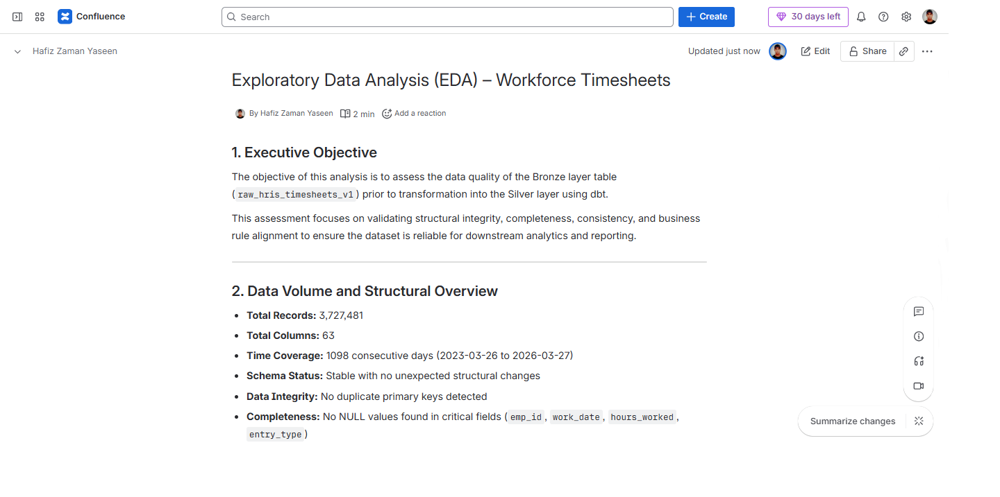

# Exploratory Data Analysis (EDA) – Workforce Timesheets

*Note: In a standard enterprise environment, this documentation is maintained on internal platforms such as Confluence. A snapshot is included below for reference, followed by a complete searchable version for repository indexing.*

---

### 🏢 Enterprise Documentation (Confluence Snapshot)

---

## 1. Executive Objective

The objective of this analysis is to assess the data quality of the Bronze layer table (`raw_hris_timesheets_v1`) prior to transformation into the Silver layer using dbt.  

This assessment focuses on validating structural integrity, completeness, consistency, and business rule alignment to ensure the dataset is reliable for downstream analytics and reporting.

---

## 2. Data Volume and Structural Overview

* **Total Records:** 3,727,481  
* **Total Columns:** 63  
* **Time Coverage:** 1098 consecutive days (2023-03-26 to 2026-03-27)  
* **Schema Status:** Stable with no unexpected structural changes  
* **Data Integrity:** No duplicate primary keys detected  
* **Completeness:** No NULL values found in critical fields (`emp_id`, `work_date`, `hours_worked`, `entry_type`)  

---

## 3. Key Findings

### 3.1 Correction Records (Negative Values)

* **Issue:** A total of 50,908 records (~1.36% of dataset) contain negative working hours and corresponding financial reversals.  
* **Context:** These entries represent valid correction transactions rather than data errors.  
* **Implication:** If not handled properly, these records can distort total hours, revenue, and profit calculations.  

---

### 3.2 Zero-Hour Entries

* **Issue:** Approximately 30% (~1.13 million records) contain 0.0 working hours.  
* **Context:** These entries represent a mix of non-working days (leave, holidays), missing submissions, and system-generated placeholders.  
* **Implication:** These records significantly distort average-based metrics such as utilization and productivity if included without conditional logic.  

---

### 3.3 Categorical Consistency

* **Issue:** The `entry_type` field contains only two valid categories: `original` and `correction`. No malformed or inconsistent categorical values were detected.  
* **Implication:** Data is clean from a categorical perspective; however, correction logic must be handled carefully to avoid double-counting.  

---

### 3.4 Financial Consistency

* **Issue:** Revenue and profit fields exhibit balanced positive and negative ranges aligned with correction entries. No extreme or out-of-bound financial values were detected.  
* **Implication:** Financial data is structurally consistent, but requires netting logic to ensure accurate profitability reporting.  

---

### 3.5 Data Freshness

* **Issue:** The latest available data corresponds to 2026-03-27, reflecting an initial manual ingestion. The ingestion process is currently operating in an ad-hoc (non-scheduled) mode.  
* **Implication:** Dashboards based on this dataset will reflect stale data until a scheduled pipeline is established.  

---

## 4. Transformation Strategy (Silver Layer)

Based on the findings, the following transformations will be implemented in the dbt staging layer (`stg_timesheets.sql`):

* Apply standardized column naming conventions to align with enterprise data modeling practices  
* Implement net aggregation logic to correctly handle correction (negative) records  
* Introduce conditional logic to exclude or handle 0.0-hour entries in productivity and utilization calculations  
* Maintain consistency across hours, revenue, and profit metrics during aggregation  
* Introduce data quality flags to track correction and non-working entries for downstream analytics  
* Implement a scheduled ingestion pipeline (e.g., CRON or GitHub Actions)  
* Perform a one-time historical backfill to address data freshness gaps  

---

## 5. Overall Data Quality Assessment

**No critical data quality blockers have been identified.**  

The dataset demonstrates strong structural integrity with no duplicate records, no NULL values in critical fields, and a stable schema.  

All identified anomalies (negative values and zero-hour entries) are aligned with expected business processes rather than data corruption.  

The only limitation observed is the absence of a scheduled ingestion pipeline, resulting in a known data freshness gap.  

From a data quality perspective, the dataset is production-ready for downstream transformation.  

**Verdict:** The dataset is considered reliable and suitable for analytical modeling, provided that the defined transformation logic is correctly implemented in the Silver layer.